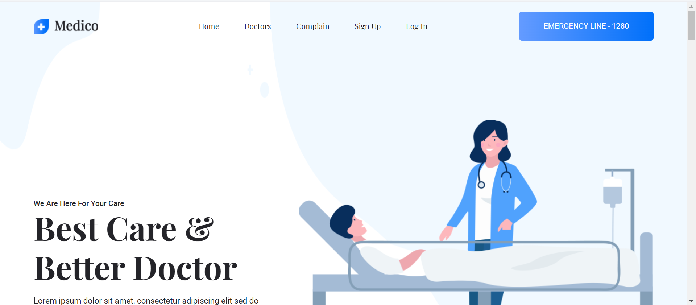
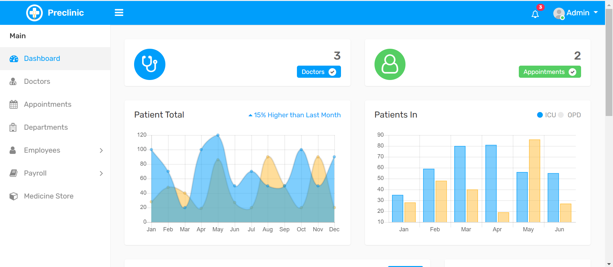
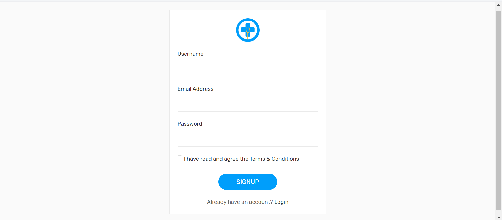
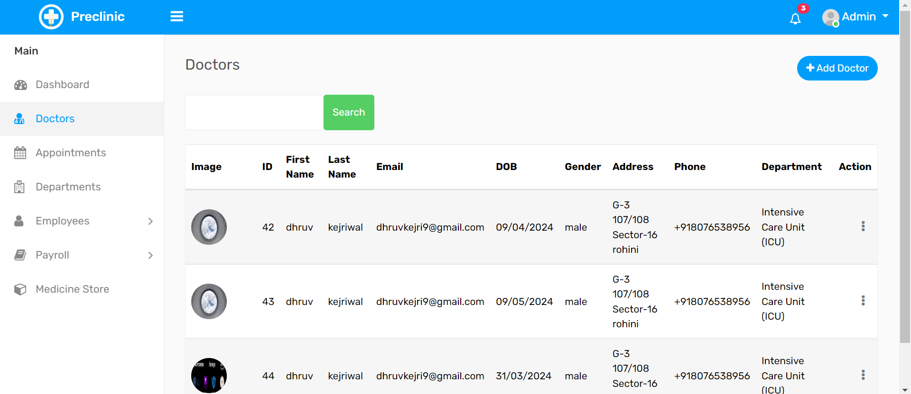
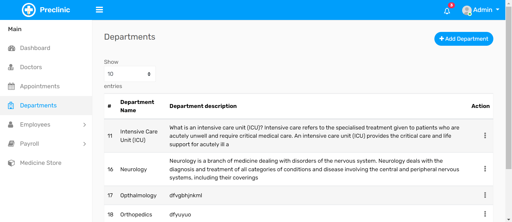
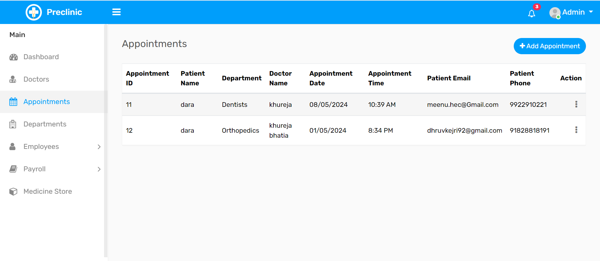
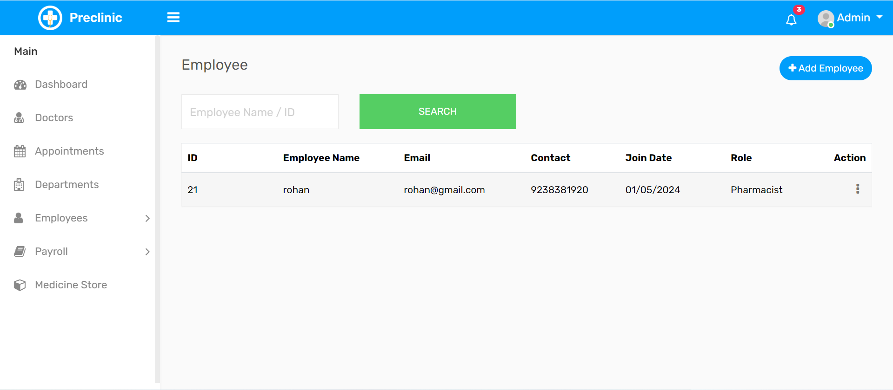
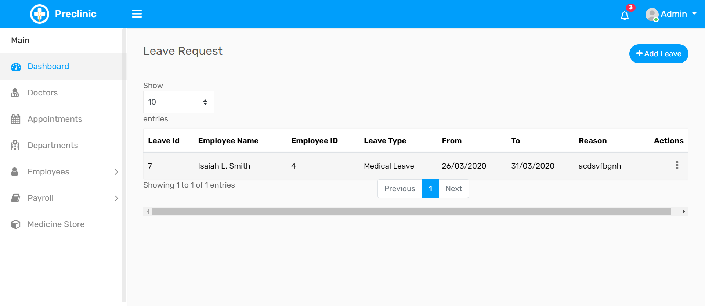
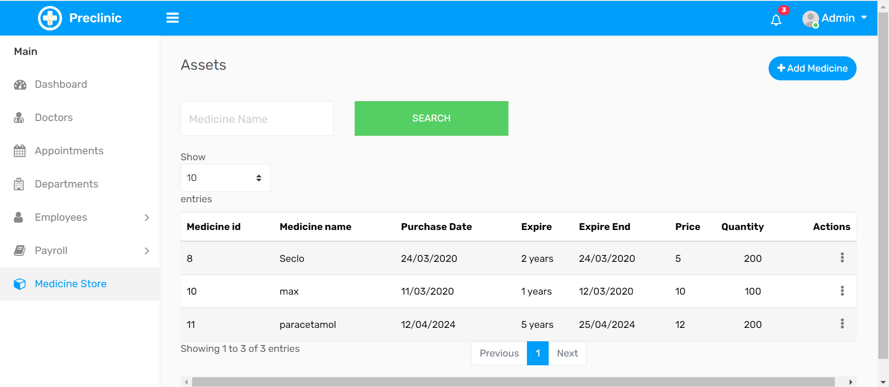
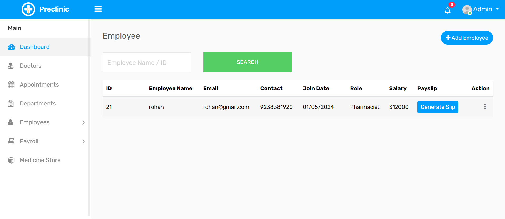

### Installation

1. **Clone or Download**: First, clone or download the project from the repository.

2. **Open Command Prompt**: Navigate to the project folder in the command prompt.

3. **Install Dependencies**: Run the following command to install the project dependencies:
   ```
   npm install
   ```
   or if you already have the dependencies installed and want to update them, you can use:
   ```
   npm update
   ```

4. **Create `.env` File**: Create a file named `.env` in the project folder, and add the following parameters with their respective values:
   ```
   SQL_HOST="XXXX.."
   SQL_USER="XXX.."
   SQL_PASS="XXXXXX.."
   ```

   Replace `"XXXX.."`, `"XXX.."`, and `"XXXXXX.."` with your actual MySQL database host, username, and password respectively.

5. **Import Database**: Navigate to the project folder using the command:
   ```
   cd HospitalManagementSystem
   ```
   Then, import the provided database file into your MySQL server using the following command:
   ```
   source database.sql
   ```

6. **Run the Application**: Start the application by running:
   ```
   nodemon app
   ```
   or
   ```
   node app
   ```

### Screenshots

Here are some screenshots of the application:

#### Home


#### Dashboard


#### Sign Up


#### Doctors


#### Departments


#### Appointments


#### Employees


#### Add Employee Leave


#### Medicine Store


#### Payroll Generation


---
